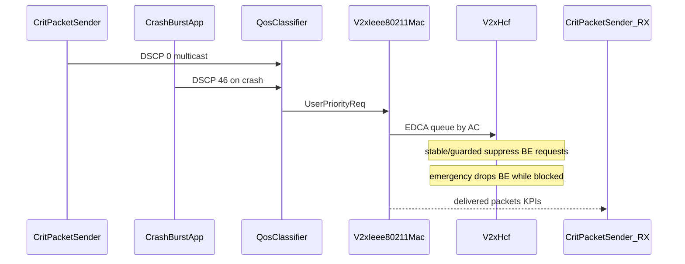

# Global Audit Report — `master_veins`

**Date:** 2026-05-18  
**Scope:** Project-owned code, simulations, KPI dashboard, and documentation (excludes third-party `inet/` and `veins/` framework docs except as dependencies).

---

## 1. Executive Summary

The active research line is a **minimal BE vs crash-VO** vehicular Wi-Fi study using Veins+INET. The **authoritative experiment surface** is:

- `veins_inet_highway_light` (10 vehicles)
- `veins_inet_highway_heavy` (100 vehicles)

Each package exposes five MAC policies × three network-load levels (15 runnable matrix configs per density).

**Legacy `edca_v2x_be_friendly` and `edca_v2x_vo_protect`** still exist in `omnetpp.ini` for square/highway legacy packages but are **not part of the publication matrix**, use **older V2X tuning**, and had **broken `run` wrappers** (fixed to match active scenarios). They map conceptually to milder/stronger adaptive blocking, superseded by `stable` / `guarded` / `emergency`.

**Research alignment:** Implementation matches the thesis goal (DSCP-marked crash VO vs ordinary BE under DCF, EDCA, and adaptive V2X). Claims must treat adaptive modes as **protection-with-BE-cost**, not pure scheduler fairness.

---

## 2. Simulation Mode Map

### 2.1 Active highway density study

| Config family | OMNeT++ config prefix | Runtime behavior |
|---------------|----------------------|------------------|
| DCF baseline | `plain_netload_*` | Non-QoS DCF; DSCP tags exist but no EDCA prioritization |
| Default EDCA | `edca_only_netload_*` | `QosClassifier` + standard `Hcf` |
| V2X stable | `edca_v2x_vo_stable_netload_*` | `V2xHcf`, mild BE suppression, threshold 2, block 15ms, cap 80ms |
| V2X guarded | `edca_v2x_vo_guarded_netload_*` | `V2xHcf`, shorter blocks (4ms), cap 20ms, threshold 3 |
| V2X emergency | `edca_v2x_vo_emergency_netload_*` | `V2xHcf` + `emergencyPreemption=true`; drops/suppresses BE during VO protection |

Load overlays (`_netload_low|medium|high`) change **application traffic only** (see scenario READMEs).

**Matrix runners** (`run_matrix.sh`):

| Profile | Configs | Default `RUNS` |
|---------|---------|----------------|
| `quick` | 2 high-load (plain + guarded) | `0` |
| `core` | 5 high-load (all policies) | `0` |
| `full` | All 15 policy×load combos | `0` |

Simulation horizon: **70s**; crash at **30s**, duration **30s**.

### 2.2 Legacy packages

| Package | MAC configs | Status |
|---------|-------------|--------|
| `veins_inet_highway` | `plain`, `edca_only`, `edca_v2x`, `edca_v2x_be_friendly`, `edca_v2x_vo_protect` | **Deprecated** — 100s horizon, stochastic SUMO, no netload matrix |
| `veins_inet_square` | Same as highway legacy | **Deprecated** |
| `veins_inet_light` | `plain`, `edca_only`, `edca_v2x_vo_stable` | **Supporting** — fast smoke tests only |

**Legacy name mapping (conceptual):**

| Legacy | Approximate successor | Difference |
|--------|----------------------|------------|
| `edca_v2x_be_friendly` | `edca_v2x_vo_stable` | Older base `edca_v2x` (40ms block, 250ms cap) with shorter friendly tweaks |
| `edca_v2x_vo_protect` | `edca_v2x_vo_guarded` or `emergency` | Stronger blocking; no emergency BE drop |
| `edca_v2x` | `edca_v2x_vo_stable` | Umbrella config replaced by named profiles |

### 2.3 Friendly / protect functional status

- **Configs exist** in legacy `omnetpp.ini` files and are **runnable** if the simulation binary is built and TraCI is up.
- **Not wired** into `run_matrix.sh`, KPI figure exporters, or paper figure set.
- **Not documented** as active modes in top-level README (correct after doc pass).
- **Run scripts** previously invoked missing `../../bin/veins_inet_run`; now aligned with `../../src/veins_qos` launcher.

---

## 3. Implementation Architecture

| Module | File(s) | Role |
|--------|---------|------|
| BE traffic | `traffic/CritPacketSender.*` | Periodic BE TX; RX stats; VO dedup by (src,seq) |
| Crash VO | `traffic/CrashBurstApp.*` | Node `targetNodeIndex` (default 0); TraCI stop; VO bursts |
| Classifier | `qos/QosClassifier.*` | DSCP 46 → `UP_VO`; else BE |
| MAC stats | `mac/V2xIeee80211Mac.*` | Per-AC drop counters |
| Adaptive MAC | `mac/V2xHcf.*`, `V2xEdcaFsmController.*` | FSM blocking; emergency preemption |
| Integration | `veins_inet/VeinsInetCar.ned`, `VeinsInetApplicationBase.*` | Multicast `224.0.0.1`, TraCI |

---

## 4. Recent Changes (Git)

| Commit | Impact |
|--------|--------|
| `ffc52b4` | Emergency preemption in `V2xHcf`; VO protection metrics |
| `d9ee3b2` | Overheard VO triggers protection; debug logging added (should be removed for publication) |
| `7ffc5d0` | High-load VO stress: 20ms interval, repeatCount 8 |
| `cdf4a67` | Emergency configs for low/medium netload |
| `c8c9e19` / `ffc52b4` | Python → Rust KPI dashboard |
| `e5f35e2` | `export_figures` + publication SVGs on `feat/new_dash` |

---

## 5. Obsolete / Deprecated

| Item | Recommendation |
|------|----------------|
| `edca_v2x_be_friendly`, `edca_v2x_vo_protect` | Keep configs; mark deprecated; exclude from paper reproduction |
| `VeinsInetCritTrafficApp.ned` | Orphan NED — remove or implement |
| `VeinsInetSampleApplication.*` | Unused by active configs — keep for Veins template or remove from build |
| `uppaal/` references in old `AI_CONTEXT.md` | Removed; directory absent |
| `highway_plain` aliases in legacy README | Not in `omnetpp.ini` — documentation error |
| Hardcoded `.cursor/debug-9574a1.log` | Remove before publication |

---

## 6. Inconsistencies (Doc ↔ Code ↔ KPI)

| Issue | Severity | Detail |
|-------|----------|--------|
| `AI_CONTEXT.md` load profiles / sim time | High | Said 100s and old intervals; highway active uses 70s and current netload table |
| P95/jitter scope | Medium | Parser uses `Scenario.node[0].app[0]` vectors only; scalar means aggregate all nodes |
| `voDedupWindow` | Medium | Name looks like a sliding window; code keeps first copy of each `(src, seq)` for the whole run (on/off via `> 0`). Documented in NED; expiry not used because crash usefulness is first copy of a logical sequence. |
| VO delay timestamp | Medium | **Fixed:** `CrashBurstApp` now stamps `logicalCreationTime` on `CreationTimeTag`. |
| BE `exponential(mean)` frozen per node | High | **Fixed:** `sendInterval` is `volatile` and redrawn on every packet. |
| Figure axis labels | Medium | Bar charts had strategy/value axes swapped in SVG labels (fixed in exporter) |
| Dynamic `fig_XX` numbering | Low | Skipped figures shifted indices (fixed) |
| `SCIENTIFIC_DASHBOARD.md` UI sections | Low | Describes 7 dashboard sections; UI has 4 tables only |
| Mixed `results/` directories | High | Old and new profiles averaged if not archived |

---

## 7. Broken or Suspicious Behaviors

1. **Emergency mode** — Intentionally drops BE; must be reported as cost, not only VO gain.
2. **Multicast KPIs** — Use RX/TX ratios; not unicast delivery guarantees.
3. **Overheard VO activation** — Any received VO-classified frame extends protection (by design for crash awareness).
4. **Non-emergency stale BE grants** — Only emergency suppresses grants in `channelGranted()`; stable/guarded defer requests only.
5. **fig_07 on light density** — May be omitted if V2X counters are zero in cached results.
6. **export_figures** — Always full re-parse (no cache read); slow but deterministic.

---

## 8. Missing Documentation (addressed in this pass)

- Global audit and repo map (this file, `REPOSITORY_MAP.md`)
- Canonical README template (`docs/README_STANDARD.md`)
- Metric scope (node[0] vectors, logical vs physical VO TX)
- Legacy deprecation banners on scenario READMEs
- Publication checklist (`docs/PUBLICATION_CHECKLIST.md`)
- Friendly/protect deprecation note

---

## 9. Cleanup Plan (Pre-Publication)

### Phase A — Safe (done or in progress)

- [x] Audit artifacts
- [x] Standardize README structure
- [x] Remove debug logging from production sources
- [x] Fix exporter axis labels and stable figure numbering
- [x] Repair legacy `run` scripts
- [x] Update `AI_CONTEXT.md` to match active configs

### Phase B — Recommended before submission

- [ ] Re-run `PROFILE=full` matrix with documented seeds; archive `results/`
- [ ] Regenerate all `publication_figures/` after exporter fixes
- [ ] Wire figures into `ETFA-2026---Paper/text.tex` with consistent stems
- [ ] Add confidence intervals externally (dashboard gives run means only)
- [ ] Decide fate of `VeinsInetCritTrafficApp.ned` and sample apps

### Phase C — Optional refactor

- [ ] Move legacy scenarios under `simulations/_legacy/`
- [ ] Add `veins_qos/README.md` as module index
- [ ] Implement expiring `voDedupWindow` or rename parameter

---

## 10. Documentation Improvement Plan

1. **Single terminology glossary** in `docs/README_STANDARD.md`
2. **Top-level README** — reproduction path only for active study
3. **Per-scenario README** — matrix, load table, deprecation banner for legacy
4. **`AI_CONTEXT.md`** — implementation truth for agents; sync with `omnetpp.ini`
5. **`kpi_dashboard/METRICS.md`** — optional deep metric dictionary (covered in README + SCIENTIFIC_DASHBOARD)
6. **Paper `AI_CONTEXT`** — point to `edca_v2x_vo_*` and figure export path

---

## 11. Recommended Repository Structure

See [`REPOSITORY_MAP.md`](REPOSITORY_MAP.md) § Recommended Long-Term Structure.

---

## 12. Publication Figure Catalog

| ID | Slug | Required data |
|----|------|----------------|
| fig_01 | `p95_delay_priority_gap` | BE/VO P95 at high load |
| fig_02 | `mac_drop_rate_by_strategy_load` | `mac_drop_per_tx` all loads |
| fig_03 | `vo_reception_by_strategy_load` | `vo_rx_per_tx` |
| fig_04 | `latency_jitter_tradeoff` | Mean delay + jitter |
| fig_05 | `mac_drop_attribution_high_load` | Per-AC MAC drops |
| fig_06 | `vo_delay_cdf_high_load` | VO delay vectors |
| fig_07 | `v2x_control_actions_by_load` | V2X HCF counters (V2X modes only) |

Exporter writes `fig_{NN}_{slug}_{highway_light|highway_heavy}.{svg,png,pdf}`.

---

*This report should be updated when MAC policies, load profiles, or parser versions change.*
