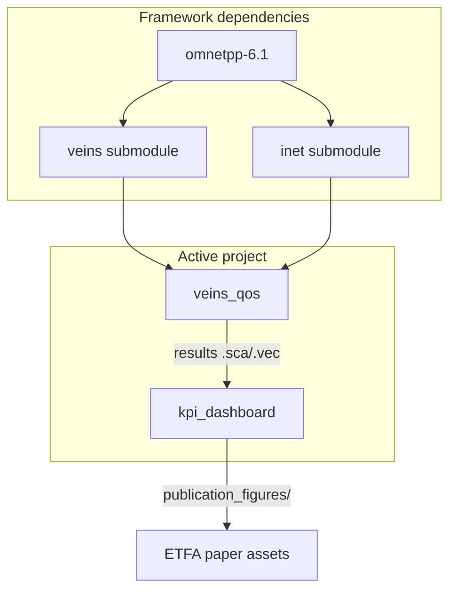

# Repository Map — `master_veins`

This document describes how the workspace pieces fit together for reproducibility and maintenance.

## Top-Level Layout

| Path | Role | Edit policy |
|------|------|-------------|
| [`veins_qos/`](veins_qos/) | Active OMNeT++ project: traffic apps, QoS classifier, V2X MAC, simulations | Primary development target |
| [`kpi_dashboard/`](kpi_dashboard/) | Rust KPI parser, local web tables, publication figure exporter | Active analysis tooling |
| [`veins/`](veins/) | Veins framework (git submodule) | Read-only unless upgrading framework |
| [`inet/`](inet/) | INET framework (git submodule) | Read-only unless upgrading framework |
| [`omnetpp-6.1/`](omnetpp-6.1/) | OMNeT++ installation tree | Dependency only |
| [`ap_servers/`](ap_servers/) | Legacy RSU/AP experiments | Not part of current thesis baseline |
| [`images/`](images/) | Shared OMNeT++ image assets | Supporting assets |

## Dependency Flow



## `veins_qos` Internal Structure

| Directory | Responsibility |
|-----------|----------------|
| `src/traffic/` | `CritPacketSender` (BE), `CrashBurstApp` (crash VO bursts) |
| `src/qos/` | `QosClassifier` — DSCP → user priority |
| `src/mac/` | `V2xHcf`, `V2xEdcaFsmController`, `V2xIeee80211Mac` |
| `src/veins_inet/` | Veins+INET car, mobility, application base |
| `simulations/veins_inet_highway_light/` | **Active** — 10 vehicles, full MAC × load matrix |
| `simulations/veins_inet_highway_heavy/` | **Active** — 100 vehicles, full MAC × load matrix |
| `simulations/veins_inet_highway/` | Legacy highway (stochastic flows, old V2X names) |
| `simulations/veins_inet_square/` | Legacy square topology |
| `simulations/veins_inet_light/` | Fast validation scenario |

## Simulation → Results → Figures

1. Start TraCI: `veins/bin/veins_launchd`
2. Run matrix: `veins_qos/simulations/veins_inet_highway_*/run_matrix.sh`
3. Outputs: `simulations/.../results/*.sca`, `*.vec`
4. Parse: `kpi_dashboard` (`cargo run --release -- --rebuild`)
5. Export: `cargo run --release --bin export_figures -- --results ... --output publication_figures`

## Git Branches (snapshot)

- `main` — baseline through emergency netload configs
- `feat/new_dash` — adds Rust `export_figures` and committed publication SVGs

Submodules: `inet`, `veins` (pinned commits in parent repo).

## Documentation Index

| Document | Audience |
|----------|----------|
| [`README.md`](README.md) | First-time users, reproduction quick start |
| [`AUDIT_REPORT.md`](AUDIT_REPORT.md) | Maintainers, pre-publication review |
| [`docs/README_STANDARD.md`](docs/README_STANDARD.md) | Canonical README template and terminology |
| [`veins_qos/AI_CONTEXT.md`](veins_qos/AI_CONTEXT.md) | Agents and deep implementation context |
| [`kpi_dashboard/README.md`](kpi_dashboard/README.md) | Dashboard and export operations |
| [`kpi_dashboard/SCIENTIFIC_DASHBOARD.md`](kpi_dashboard/SCIENTIFIC_DASHBOARD.md) | Figure rationale for the paper |
| `veins_qos/simulations/*/README` | Per-scenario run instructions |

## Recommended Long-Term Structure

```
master_veins/
  README.md
  AUDIT_REPORT.md
  REPOSITORY_MAP.md
  docs/
    README_STANDARD.md
    PUBLICATION_CHECKLIST.md
  veins_qos/
    README.md                 # optional: project-focused entry
    simulations/
      veins_inet_highway_light/
      veins_inet_highway_heavy/
      _legacy/                # future: move square/highway/light here
  kpi_dashboard/
  inet/  veins/  omnetpp-6.1/   # submodules / deps unchanged
```

Keep legacy scenarios visible but clearly marked deprecated; do not mix their `results/` with active highway study outputs.
